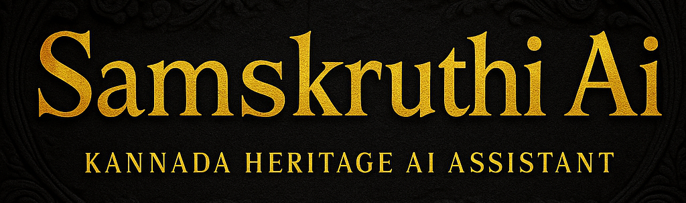

  

 

# Namma Samskruthi ChatBot 🎙️✨

A simple and interactive chatbot that provides information about Karnataka’s inscriptions, archaeological sites, and cultural heritage.  
The goal of this project is to make learning about our culture **easy, friendly, and voice-based**.

---

## 🎯 What This Chatbot Can Do
- Understand your **voice input**
- Provide **cultural and historical information**
- Give responses in a **natural conversational style**
- Simple and easy to use for students & general users

---

## 🛠️ How to Use
1. Download or Clone this repository.
2. Open the file **`index.html`** in your web browser (Chrome recommended).
3. Allow **microphone access**.
4. Start speaking and explore Karnataka’s heritage! 🌿

_No coding setup required. No installations. Just open and use._

---

## ✨ Purpose of the Project
This project was created to:
- Demonstrate the use of AI in cultural education.
- Show how voice interaction can improve user learning experience.
- Present a meaningful application for Karnataka Rajyotsava / academic submission.

---

## 📦 Technologies Used
- Google AI Studio (Model Responses)
- HTML, CSS, JavaScript
- Web Speech API (Voice Input)

---

## 👤 Developed By
**Name:** *Sanjeev Kumar (Sanz)*  
**Role:** AI & ML Engineering Student  
